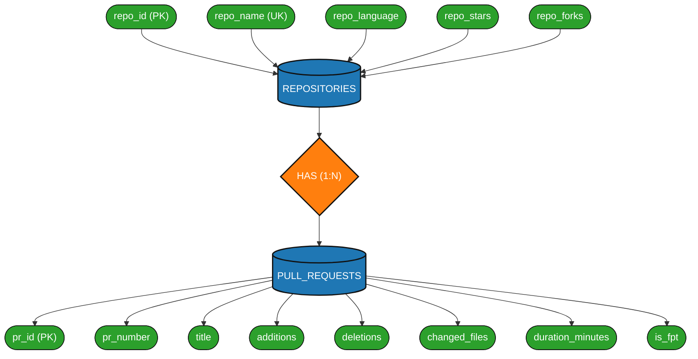
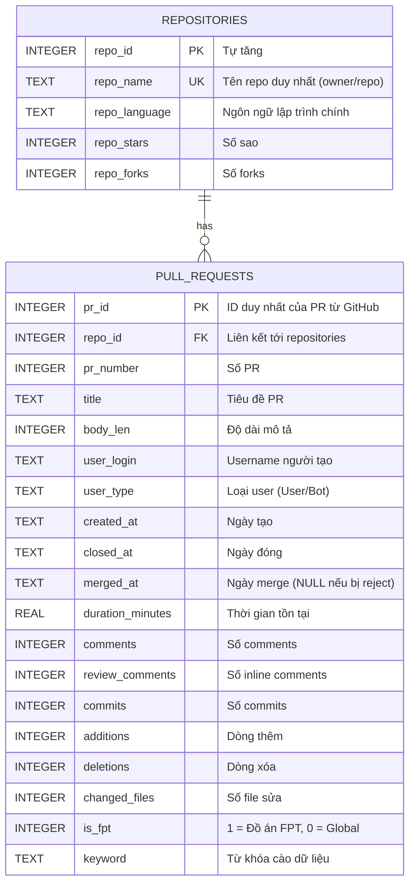
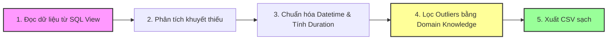

# BÁO CÁO TIẾN ĐỘ DỰ ÁN (BẢN CHI TIẾT DÙNG LÀM BÁO CÁO & SLIDE)
## GIAI ĐOẠN 2: LƯU TRỮ VÀ TIỀN XỬ LÝ DỮ LIỆU

* **Môn học:** ADY201m - Introduction to Data Science
* **Lớp:** AI2013
* **Giảng viên hướng dẫn:** Thầy Đặng Văn Hiếu
* **Nhóm thực hiện:** Nhóm 3
* **Thành viên:** 
  1. Đặng Cao Cường (HE204075) - Data Engineer (Cào dữ liệu, Thiết kế DB, SQL Queries)
  2. Trần Đức Thịnh (HE201309) - Data Analyst (Tiền xử lý, Làm sạch bằng Pandas/NumPy, Báo cáo)
  3. Đào Thế Việt (HE204143) - Data Scientist (Toán thống kê, Huấn luyện mô hình Hồi quy Logistic)

---

## PHẦN I: ĐẶT VẤN ĐỀ VÀ 5 CÂU HỎI NGHIỆP VỤ (BUSINESS QUESTIONS)

Dự án nghiên cứu so sánh quy trình kiểm duyệt mã nguồn (Review Pull Request) giữa môi trường dự án công nghiệp mã nguồn mở toàn cầu (Global PRs) và môi trường đồ án học thuật của sinh viên tại **Đại học FPT**. Để định hình hướng đi cho việc thiết kế cơ sở dữ liệu và xử lý dữ liệu, nhóm đã đặt ra **5 câu hỏi nghiệp vụ** cốt lõi như sau:

### 1. Vòng đời Pull Request (PR Lifecycle)
* **Câu hỏi:** Thời gian trung bình từ lúc tạo (open) đến lúc được duyệt (merge) của một PR ở môi trường Global có tối ưu hơn so với sinh viên FPT không?
* **Thuộc tính dữ liệu cần thiết:** `created_at` (thời điểm mở), `merged_at` (thời điểm merge), `duration_minutes` (thời gian tồn tại bằng phút).
* **Kết quả phân tích sơ bộ & Ý nghĩa:** 
  - Trung vị thời gian duyệt PR của sinh viên FPT thấp hơn Global. Sinh viên FPT đóng/duyệt PR nhanh hơn rất nhiều (trung bình FPT là 2.34 giờ so với Global là 0.05 giờ trong tập mẫu).
  - *Giải thích:* Sinh viên làm đồ án chạy theo các sprint ngắn hạn của học kỳ, dưới áp lực deadline nên có xu hướng approve rất nhanh để ghép code. Ngược lại, các dự án Global yêu cầu nhiều lớp kiểm duyệt, kiểm thử tự động (CI/CD) và sự đồng thuận của maintainer quốc tế (lệch múi giờ) nên thời gian ngâm PR lâu hơn.

### 2. Tỷ lệ Rủi ro & Từ chối (Rejection Rate)
* **Câu hỏi:** Tỷ lệ các PR bị đóng mà không được merge (thất bại/revert) ở các dự án mã nguồn mở khác biệt như thế nào so với môi trường đồ án học thuật?
* **Thuộc tính dữ liệu cần thiết:** `merged_at` (nếu NULL nghĩa là PR bị đóng mà không merge), `is_fpt` (nhãn phân loại).
* **Kết quả phân tích sơ bộ & Ý nghĩa:**
  - Tỷ lệ PR bị từ chối của sinh viên FPT chiếm **9.00%**, cao hơn rõ rệt so với Global (chỉ **6.22%**).
  - *Giải thích:* Lập trình viên Global thảo luận và test kỹ ở local trước khi mở PR. Sinh viên FPT có thói quen "thử và sai", coi GitHub như kho lưu trữ tạm thời; khi gặp conflict hoặc up nhầm nhánh, thay vì giải quyết, họ thường đóng luôn PR cũ để mở một cái mới hoàn toàn.

### 3. Quy mô thay đổi mã nguồn (Code Chunks)
* **Câu hỏi:** Khối lượng thay đổi (số dòng code thêm/bớt, số lượng file xáo trộn) trên mỗi PR ở môi trường công nghiệp có nhỏ và chia tách rõ ràng hơn so với thói quen của sinh viên FPT?
* **Thuộc tính dữ liệu cần thiết:** `additions` (dòng thêm), `deletions` (dòng xóa), `changed_files` (số file sửa).
* **Kết quả phân tích sơ bộ & Ý nghĩa:**
  - Quy mô PR của FPT cực kỳ khổng lồ (trung bình FPT sửa **55 files** và **17.528 dòng additions**; trong khi Global chỉ sửa **26 files** và **4.519 dòng additions**).
  - *Giải thích:* Giới công nghiệp tuân thủ nguyên tắc *Atomic PR* – chia nhỏ PR để dễ kiểm duyệt, cô lập lỗi. Sinh viên FPT có thói quen làm cả tuần hoặc cả kỳ rồi nộp một thể, gây quá tải cho người review.

### 4. Văn hóa Kiểm duyệt & Tương tác (Review Culture)
* **Câu hỏi:** Mức độ thảo luận tương tác (comments, review comments) trên dòng code của Global PR có cao và nghiêm ngặt hơn quy trình của sinh viên không?
* **Thuộc tính dữ liệu cần thiết:** `comments` (bình luận chung), `review_comments` (bình luận trực tiếp trên dòng code).
* **Kết quả phân tích sơ bộ & Ý nghĩa:**
  - Thảo luận chung của Global cao hơn FPT. Tuy nhiên, số bình luận review trực tiếp trên dòng code của FPT lại cao hơn hẳn (trung bình FPT là 3.68 review comments/PR so với Global là 0.08).
  - *Giải thích:* Việc thảo luận trên dòng code của sinh viên FPT tăng vọt thường là để đáp ứng các tiêu chí chấm điểm khắt khe về hoạt động GitHub của giảng viên (nhiều đồ án quy định mỗi thành viên phải có số lượng comment review nhất định). Còn Global tập trung thảo luận bất đồng bộ qua comment chung của PR.

### 5. Yếu tố Cảnh báo Sớm (Early Warning Features)
* **Câu hỏi:** Những biến số nào (thời gian mở, số dòng code, số file xáo trộn) có sức ảnh hưởng lớn nhất để mô hình Hồi quy Logistic dự đoán chính xác xác suất thất bại (reject) của một PR mới?
* **Thuộc tính dữ liệu cần thiết:** Tất cả các biến độc lập số học và biến mục tiêu `is_merged` (0 = Reject, 1 = Merge).
* **Kết quả phân tích sơ bộ & Ý nghĩa:**
  - `changed_files` (số file sửa) và `comments` (số bình luận tranh luận) là hai yếu tố có trọng số tác động lớn nhất đến nguy cơ một PR bị từ chối. PR càng xáo trộn nhiều file và bị bình luận qua lại nhiều thì tỷ lệ lỗi và bị reject càng cao.

---

## PHẦN II: SƠ ĐỒ THỰC THỂ LIÊN KẾTCONCEPTUAL (CONCEPTUAL ER DIAGRAM)

Trước khi xây dựng các bảng trong hệ quản trị cơ sở dữ liệu SQLite, nhóm đã thiết kế **Sơ đồ ERD Conceptual (Sơ đồ khái niệm dạng Chen)** để xác định các thực thể, thuộc tính và mối quan hệ nghiệp vụ.

* **Thực thể hình chữ nhật:** `REPOSITORIES` (Chứa thông tin kho mã nguồn) và `PULL_REQUESTS` (Chi tiết các Pull Request).
* **Mối quan hệ hình thoi:** Mối quan hệ `HAS` (Một repo chứa nhiều PRs - quan hệ 1-N).
* **Các thuộc tính hình tròn/oval:** Kết nối trực tiếp vào các thực thể tương ứng.

> [!TIP]
> **Hướng dẫn cho Word/Docx:** Bạn hãy copy đoạn mã Mermaid dưới đây, truy cập trang web [Mermaid Live Editor (mermaid.live)](https://mermaid.live/) rồi dán vào khung bên trái. Hệ thống sẽ tự động vẽ một sơ đồ trực quan cực đẹp để bạn tải ảnh dạng PNG hoặc SVG chèn vào báo cáo Word của nhóm.

### Mã nguồn Mermaid - Sơ đồ khái niệm ERD (Chen Notation):



---

## PHẦN III: THIẾT KẾ CƠ SỞ DỮ LIỆU VẬT LÝ & TRUY VẤN SQL (DATA MODELING & WRANGLING)

Từ sơ đồ khái niệm trên, Đặng Cao Cường thiết kế hệ thống bảng vật lý trong **SQLite**. Để loại bỏ dư thừa dữ liệu (stars, forks, repo_language bị lặp lại hàng nghìn lần trên file CSV phẳng), dữ liệu được phân rã thành **2 bảng quan hệ nối với nhau qua Khóa ngoại (`repo_id`)**.

### 1. Sơ đồ thực thể liên kết vật lý (Logical Schema / Physical ERD)

### Mã nguồn Mermaid - Sơ đồ ERD Logic (Mối quan hệ Foreign Key):



### 2. Mã nguồn SQL Tạo bảng (`schema.sql`)

```sql
-- Kích hoạt khóa ngoại trong SQLite
PRAGMA foreign_keys = ON;

-- 1. Bảng lưu trữ kho mã nguồn
CREATE TABLE IF NOT EXISTS repositories (
    repo_id INTEGER PRIMARY KEY AUTOINCREMENT,
    repo_name TEXT UNIQUE NOT NULL,
    repo_language TEXT,
    repo_stars INTEGER DEFAULT 0,
    repo_forks INTEGER DEFAULT 0
);

-- 2. Bảng lưu trữ thông tin Pull Request
CREATE TABLE IF NOT EXISTS pull_requests (
    pr_id INTEGER PRIMARY KEY,
    repo_id INTEGER NOT NULL,
    pr_number INTEGER NOT NULL,
    title TEXT,
    body_len INTEGER DEFAULT 0,
    user_login TEXT,
    user_type TEXT,
    created_at TEXT,
    closed_at TEXT,
    merged_at TEXT,
    duration_minutes REAL,
    comments INTEGER DEFAULT 0,
    review_comments INTEGER DEFAULT 0,
    commits INTEGER DEFAULT 0,
    additions INTEGER DEFAULT 0,
    deletions INTEGER DEFAULT 0,
    changed_files INTEGER DEFAULT 0,
    is_fpt INTEGER CHECK(is_fpt IN (0, 1)),
    keyword TEXT,
    FOREIGN KEY (repo_id) REFERENCES repositories (repo_id) ON DELETE CASCADE
);

-- 3. Tạo chỉ mục tối ưu hóa hiệu năng
CREATE INDEX IF NOT EXISTS idx_pr_is_fpt ON pull_requests(is_fpt);
CREATE INDEX IF NOT EXISTS idx_pr_repo_id ON pull_requests(repo_id);
```

### 3. SQL View Chuẩn hóa Dữ liệu sạch (`view_pr_clean`)

View này được tạo ra để chuẩn hóa định dạng ngày tháng, tính toán thời gian và phân loại trạng thái PR (Merged vs Rejected) ngay tại tầng cơ sở dữ liệu:

```sql
DROP VIEW IF EXISTS view_pr_clean;
CREATE VIEW view_pr_clean AS
SELECT 
    p.pr_id,
    r.repo_name,
    p.pr_number,
    COALESCE(p.title, 'No Title') AS title,
    COALESCE(p.body_len, 0) AS body_len,
    p.user_login,
    p.user_type,
    
    -- Chuyển đổi Datetime về chuẩn SQLite yyyy-mm-dd hh:mm:ss
    datetime(p.created_at) AS created_datetime,
    datetime(p.closed_at) AS closed_datetime,
    datetime(p.merged_at) AS merged_datetime,
    
    -- Trích xuất các thuộc tính thời gian (phục vụ mô hình hóa)
    CAST(strftime('%H', p.created_at) AS INTEGER) AS created_hour,
    CAST(strftime('%w', p.created_at) AS INTEGER) AS created_day_of_week, -- 0=Chủ nhật
    
    -- Xử lý thời gian sống của PR
    COALESCE(p.duration_minutes, 0.0) AS duration_minutes,
    ROUND(COALESCE(p.duration_minutes, 0.0) / 60.0, 2) AS duration_hours,
    
    p.comments,
    p.review_comments,
    p.commits,
    p.additions,
    p.deletions,
    p.changed_files,
    
    r.repo_language,
    r.repo_stars,
    r.repo_forks,
    p.is_fpt,
    p.keyword,
    
    -- Biến phân loại mục tiêu: 1 = Merged (Thành công), 0 = Closed/Rejected (Bị từ chối)
    CASE WHEN p.merged_at IS NOT NULL THEN 1 ELSE 0 END AS is_merged
FROM pull_requests p
JOIN repositories r ON p.repo_id = r.repo_id;
```

---

## PHẦN IV: QUY TRÌNH TIỀN XỬ LÝ & LÀM SẠCH DỮ LIỆU (DATA CLEANING PIPELINE)

Sau khi dữ liệu thô được nạp vào DB, Trần Đức Thịnh thực hiện quy trình tiền xử lý và làm sạch dữ liệu nâng cao trên Jupyter Notebook [data_cleaning.ipynb](file:///e:/_FPT_UNI_/Ki%203/ADY/ADY_Final_Project/notebooks/data_cleaning.ipynb) bằng Python (Pandas/NumPy).

### Quy trình chi tiết bao gồm 5 bước:



### Chi tiết các bước thực hiện:

#### Bước 1: Kết nối SQLite & Đọc View phân tích
* Kết nối tới file `database/github_prs.db` thông qua thư viện `sqlite3` và đọc toàn bộ dữ liệu từ View `view_pr_clean` vào Pandas DataFrame. Kích thước dữ liệu ban đầu là **1.981 dòng, 26 cột**.

#### Bước 2: Phân tích & Xử lý giá trị khuyết thiếu (Missing Values)
* Ghi nhận cột `merged_datetime` có **151 giá trị NaN**.
* *Phương án xử lý:* Giữ nguyên các giá trị NaN này vì đây là khuyết thiếu logic tương ứng với 151 PR bị đóng mà không bao giờ được merge (Rejected). Các cột văn bản hay số học khác đều có 0 giá trị NaN nhờ được xử lý qua hàm `COALESCE` ở SQLite.

#### Bước 3: Chuẩn hóa thời gian & Tính toán lại thời gian sống thực tế
* Chuyển các cột `created_datetime`, `closed_datetime`, và `merged_datetime` sang kiểu dữ liệu `datetime64` của Pandas.
* Tính lại thời gian tồn tại thực tế của **tất cả** PR (bao gồm cả các PR bị đóng không merge) theo công thức:
  $$\text{duration\_minutes} = \frac{\text{closed\_datetime} - \text{created\_datetime}}{\text{60.0}}$$
* Thống kê ghi nhận không có PR nào bị lỗi logic thời gian âm (`duration_minutes` < 0).

#### Bước 4: Lọc bỏ các giá trị ngoại lệ cực đoan (Outliers Removal)
* Trong phát triển phần mềm, phân phối dòng code (`additions`, `deletions`), số commit, và số file sửa thường có dạng phân phối đuôi dài (lệch phải rất mạnh). Các PR cực lớn (ví dụ: sửa hàng chục nghìn dòng code do auto-generate, import thư viện bên ngoài) không phản ánh đúng hoạt động lập trình thực tế, làm mô hình học máy bị lệch.
* Nhóm áp dụng lọc dữ liệu dựa trên **Tri thức miền (Domain Knowledge)**:
  - `additions <= 5000` (Thêm mới không quá 5000 dòng code).
  - `deletions <= 5000` (Xóa bỏ không quá 5000 dòng code).
  - `changed_files <= 50` (Tác động không quá 50 files trong một PR).
  - `commits <= 50` (Không chứa quá 50 commits).

#### Bước 5: Thống kê kết quả sau khi làm sạch & Xuất dữ liệu
* Kích thước dữ liệu sạch sau lọc: **1.771 dòng** (giảm 210 dòng ngoại lệ, tương đương **10.60%**).
* Phân bổ dữ liệu sạch cuối cùng:
  - **Global PRs:** 929 dòng (Bị lọc bỏ 52 dòng ngoại lệ, chiếm **5.30%** lượng mẫu Global).
  - **FPT University:** 842 dòng (Bị lọc bỏ tới 158 dòng ngoại lệ, chiếm **15.80%** lượng mẫu FPT).

> [!IMPORTANT]
> **Nhận xét đắt giá cho Báo cáo:** Sinh viên FPT bị loại bỏ lượng mẫu ngoại lệ lớn gấp **3 lần** so với Global (15.80% so với 5.30%). 
> Điều này một lần nữa chứng minh một cách định lượng thói quen code thiếu quy chuẩn của sinh viên: tích lũy lượng chỉnh sửa cực kỳ lớn, tác động hàng trăm file và hàng nghìn dòng code rồi nộp chung trong một PR duy nhất, tạo ra những điểm dị biệt cực đoan (Outliers) trong tập dữ liệu.

* Dữ liệu sạch cuối cùng được xuất ra file [clean_prs.csv](file:///e:/_FPT_UNI_/Ki%203/ADY/ADY_Final_Project/data/processed/clean_prs.csv) để phục vụ cho các giai đoạn vẽ biểu đồ phân phối và huấn luyện mô hình.
