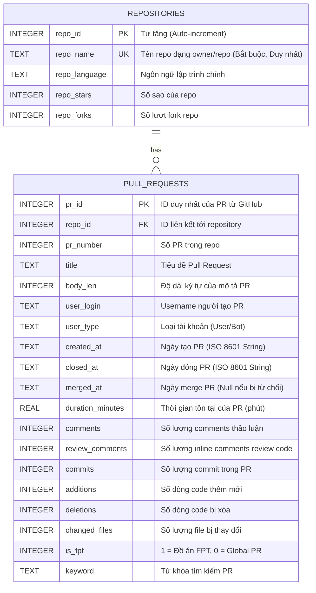

# BÁO CÁO TIẾN ĐỘ DỰ ÁN - GIAI ĐOẠN 2: LƯU TRỮ VÀ TIỀN XỬ LÝ DỮ LIỆU

* **Môn học:** ADY201m - Introduction to Data Science
* **Lớp:** AI2013
* **Giảng viên hướng dẫn:** Thầy Đặng Văn Hiếu
* **Nhóm thực hiện:** Nhóm 3
* **Thành viên chính phụ trách Giai đoạn 2:** Đặng Cao Cường (Data Engineer - SQL/DB) & Trần Đức Thịnh (Data Analyst - Tiền xử lý/Làm sạch)

---

## 1. Giới thiệu chung về Giai đoạn 2

Giai đoạn 2 của dự án tập trung vào việc **Thiết kế Cơ sở dữ liệu**, **Lưu trữ dữ liệu thô (Staging)**, **Làm sạch & Tiền xử lý dữ liệu** và **Chuẩn hóa dữ liệu** từ các tệp CSV đã thu thập được qua GitHub API. 

Mục tiêu chính của giai đoạn này là xây dựng một hệ quản trị cơ sở dữ liệu (SQLite) nhất quán, sạch sẽ, loại bỏ trùng lặp, tối ưu hóa truy vấn thông qua các Index, và tạo các View phân tích chuẩn hóa nhằm phục vụ trực tiếp cho các giai đoạn tiếp theo (EDA ở Giai đoạn 3 và Huấn luyện mô hình Hồi quy Logistic ở Giai đoạn 4).

---

## 2. Thiết kế và Chuẩn hóa Cơ sở Dữ liệu

Dữ liệu thô thu thập từ API GitHub có tính chất "phẳng" (flat) và chứa nhiều thông tin lặp đi lặp lại (ví dụ: thông tin về ngôn ngữ lập trình, số lượng stars, forks của cùng một Repository xuất hiện nhiều lần trên các dòng PR khác nhau). Để tối ưu hóa tài nguyên và đảm bảo tính toàn vẹn dữ liệu, nhóm đã tiến hành chuẩn hóa cơ sở dữ liệu về **Dạng chuẩn 3 (3NF)**.

### Sơ đồ thực thể liên kết (Entity-Relationship Diagram - ERD)

### Chi tiết cấu trúc lưu trữ:
1. **Bảng tạm `raw_pull_requests` (Staging):** Chứa dữ liệu thô nguyên bản từ file CSV để làm nguồn đối chiếu và phục vụ truy vết dữ liệu gốc.
2. **Bảng `repositories`:** Lưu trữ danh mục các kho chứa mã nguồn duy nhất. Việc tách bảng giúp tránh lặp lại thông tin ngôn ngữ, stars, forks của repository.
3. **Bảng `pull_requests`:** Chứa chi tiết các Pull Request, liên kết với bảng `repositories` qua khóa ngoại `repo_id`.
4. **Chỉ mục (Index):** Nhóm đã thiết lập các chỉ mục tối ưu trên các trường thường xuyên lọc và gom nhóm:
   - `idx_pr_is_fpt` trên trường `is_fpt` để tăng tốc độ truy vấn đối chiếu.
   - `idx_pr_repo_id` để tối ưu phép nối (JOIN).
   - `idx_pr_dates` trên các trường thời gian nhằm tối ưu hóa việc phân tích theo mốc lịch sử.

---

## 3. Kiểm tra Sức khỏe Cơ sở Dữ liệu (Database Health Check)

Sau khi Trần Đức Thịnh thực hiện tiền xử lý dữ liệu thô bằng Pandas (xử lý trùng lặp, lọc các tài khoản Bot của GitHub), dữ liệu đã được import vào cơ sở dữ liệu `github_prs.db`. Các chỉ số sức khỏe của DB cụ thể như sau:

### 3.1. Thống kê số lượng bản ghi

| Tên bảng (Table Name) | Số dòng dữ liệu (Rows count) | Trạng thái |
| :--- | :---: | :--- |
| `raw_pull_requests` (Thô) | 1,982 | Khớp hoàn toàn với file cào gốc |
| `pull_requests` (Sạch) | 1,981 | Thành công (Đã loại bỏ 1 dòng lỗi/trùng lặp) |
| `repositories` (Sạch) | 864 | Tối ưu (Đã tách thành 864 Repositories duy nhất) |

### 3.2. Phân bổ mẫu nghiên cứu (FPT vs Global)

Hệ thống ghi nhận sự phân bổ mẫu cân bằng, đảm bảo tính khách quan cho các phép kiểm định thống kê so sánh tiếp theo:
- **Global PRs (`is_fpt = 0`):** 981 PRs (chiếm **49.52%**)
- **FPT University PRs (`is_fpt = 1`):** 1,000 PRs (chiếm **50.48%**)
- **Tổng số mẫu sạch:** 1,981 Pull Requests.

---

## 4. Phân tích Dữ liệu khuyết thiếu (Missing Value Analysis)

Phân tích dữ liệu NULL trên bảng `pull_requests` thu được kết quả như sau:

* **Các trường thông tin cốt lõi:** `pr_id`, `title`, `body_len`, `created_at`, `closed_at`, `comments`, `review_comments`, `commits`, `additions`, `deletions`, `changed_files` đều có **0 giá trị NULL**. Điều này khẳng định dữ liệu đã được làm sạch triệt để trước khi nạp vào cơ sở dữ liệu chính thức.
* **Các trường có giá trị NULL:**
  - `merged_at`: **151** giá trị NULL.
  - `duration_minutes`: **151** giá trị NULL.

> [!NOTE]
> **Giải thích khoa học:** 151 giá trị NULL này hoàn toàn hợp lệ và là **Khuyết thiếu logic (Structural Missingness)**. Đây là những Pull Request bị đóng mà không được Merge (bị từ chối hoặc bị revert). 
> Cụ thể, trong tập dữ liệu có **90 PR của sinh viên FPT** bị từ chối và **61 PR của Global** bị từ chối (Tổng cộng 90 + 61 = 151 PRs). Đối với các PR này, trường thời gian merge (`merged_at`) và thời gian tồn tại cho tới khi merge (`duration_minutes`) mặc nhiên là NULL.

---

## 5. Thống kê Ngôn ngữ lập trình trong tập mẫu

Sự phân bổ ngôn ngữ lập trình phản ánh rõ nét đặc trưng của hai môi trường nghiên cứu:

| Ngôn ngữ (Language) | Tổng số Repo | Số Repo của FPT | Số Repo của Global |
| :--- | :---: | :---: | :---: |
| **Java** | 411 | 316 | 95 |
| **TypeScript** | 369 | 269 | 100 |
| **C#** | 312 | 213 | 99 |
| **JavaScript** | 279 | 183 | 96 |
| **Go** | 100 | 0 | 100 |
| **Python** | 99 | 0 | 99 |
| **PHP** | 99 | 1 | 98 |
| **Ruby** | 98 | 0 | 98 |
| **C++** | 98 | 0 | 98 |
| **HTML** | 96 | 2 | 94 |
| **Các ngôn ngữ khác** *(TSQL, Dart, Rust...)* | 20 | 18 | 2 |

> [!TIP]
> **Nhận xét chuyên môn:** Dữ liệu đồ án FPT tập trung rất lớn vào **Java**, **TypeScript**, **C#**, và **JavaScript**. Điều này hoàn toàn tương thích với khung chương trình đào tạo của Đại học FPT (các môn học như PRJ301, SWP391, Capstone Project chủ yếu sử dụng các công nghệ này). 
> Ngược lại, dữ liệu Global phân bổ đều hơn trên 10 ngôn ngữ lập trình phổ biến, cho thấy tính đa dạng của hệ sinh thái mã nguồn mở toàn cầu.

---

## 6. Xây dựng SQL View phục vụ Tiền xử lý & Wrangling nâng cao

Để đơn giản hóa việc phân tích dữ liệu và cung cấp tập dữ liệu đầu vào chuẩn hóa cho mô hình dự báo ở Giai đoạn 4, nhóm đã xây dựng SQL View mang tên `view_pr_clean` thực hiện các tác vụ Wrangling sau:
1. **Chuẩn hóa Datetime:** Chuyển đổi chuỗi thời gian thô từ API về chuẩn ISO-8601 của SQLite (`YYYY-MM-DD HH:MM:SS`).
2. **Trích xuất Đặc trưng Thời gian:** Trích xuất giờ tạo PR (`created_hour` từ 0 đến 23) và ngày trong tuần (`created_day_of_week` từ 0 đến 6, trong đó 0 là Chủ Nhật). Đây là các biến độc lập quan trọng cho mô hình phân loại.
3. **Tính toán thời gian hoàn thành (Duration in Hours):** Chuyển đổi `duration_minutes` sang `duration_hours` để dễ trực quan hóa.
4. **Xử lý giá trị NULL của Tiêu đề:** Sử dụng `COALESCE(p.title, 'No Title')` để đảm bảo không có tiêu đề rác.
5. **Dán nhãn biến mục tiêu (Target Variable):** Tạo trường `is_merged` (1 = Đã Merge/Thành công, 0 = Bị đóng không merge/Thất bại). Đây chính là nhãn phân loại phục vụ bài toán Học máy giám sát (Supervised Machine Learning) ở Giai đoạn 4.

---

## 7. Phát hiện Quan trọng & Hạn chế của Bộ dữ liệu (Critical Data Insights)

Quá trình kiểm tra sức khỏe cơ sở dữ liệu đã mang lại một số thống kê mô tả sơ khởi rất thú vị nhưng cũng chỉ ra hạn chế kỹ thuật cần báo cáo với giảng viên hướng dẫn:

### 7.1. Đối chiếu quy mô mã nguồn (Code Scale Comparison)

| Nhóm đối chiếu | Trung bình Additions (Dòng thêm) | Trung bình Deletions (Dòng xóa) | Trung bình Changed Files (Số file sửa) |
| :--- | :---: | :---: | :---: |
| **Global PRs** | 4,519.04 lines | 727.25 lines | 26.09 files |
| **FPT University** | 17,528.45 lines | 6,498.46 lines | 55.56 files |

> [!IMPORTANT]
> **Insight quan trọng:** Pull Request của sinh viên FPT có quy mô cực kỳ lớn (trung bình hơn **17 nghìn dòng code thêm mới** và **55 file thay đổi** trên mỗi PR, gấp 3-4 lần so với Global). 
> Thống kê này chứng minh sinh viên FPT chưa áp dụng nguyên tắc *Atomic PR* (PR nguyên tử - chia nhỏ để dễ review) mà có thói quen "gộp code" làm cả tuần/cả kỳ rồi đẩy lên một lần. Điều này làm tăng độ phức tạp và rủi ro lỗi trong quy trình Code Review.

### 7.2. So sánh tỷ lệ từ chối (Rejection Rate)

- Tỷ lệ PR bị từ chối của Global: **6.22%** (61 / 981 PRs)
- Tỷ lệ PR bị từ chối của sinh viên FPT: **9.00%** (90 / 1000 PRs)
- Sinh viên FPT có tỷ lệ PR bị đóng mà không được merge cao hơn, cho thấy thói quen "thử và sai" trên GitHub (khi gặp conflict hoặc lỗi thường đóng PR cũ tạo PR mới thay vì sửa đổi trực tiếp trên nhánh).

### 7.3. Hạn chế về Phân bổ Thời gian của Dữ liệu Global (Data Limitation & Bias)

Trong quá trình phân tích lịch sử thời gian, nhóm phát hiện ra một sự sai lệch (bias) rất quan trọng trong bộ dữ liệu Global:

* **Mốc thời gian cào dữ liệu (Date Ranges):**
  - **FPT PRs:** Dữ liệu trải dài từ **26/01/2023** đến **02/06/2026** (Hơn 3 năm dữ liệu thực tế).
  - **Global PRs:** Toàn bộ 981 PRs đều được tạo và đóng trong khoảng thời gian cực ngắn từ **23:06:11 ngày 02/06/2026** đến **01:25:47 ngày 03/06/2026** (Chỉ trong vòng **2 tiếng**).
* **Hậu quả trực tiếp:**
  - Thời gian xử lý PR trung bình (`avg_duration_hours`) của Global trong tập dữ liệu chỉ là **0.05 giờ (khoảng 3 phút)**, trong khi của FPT là **2.34 giờ**.
  - Thực tế này không phản ánh đúng thời gian review thực tiễn của giới công nghiệp toàn cầu (thường kéo dài từ vài giờ đến vài ngày).

> [!WARNING]
> **Nguyên nhân & Đề xuất giải pháp khắc phục:**
> 1. **Nguyên nhân:** Script cào dữ liệu thô `crawl_prs.py` sử dụng câu truy vấn tìm kiếm `is:pr is:closed language:{lang}` của GitHub API mà không thiết lập sắp xếp theo thời gian (`sort=created` hoặc `sort=updated`). Do đó, GitHub Search API đã trả về các PR được đóng gần nhất tại thời điểm cào dữ liệu, vô tình kéo theo các PR tự động (automated/CI) hoặc các PR sửa lỗi cực nhỏ được merge siêu tốc trong 2 tiếng đó.
> 2. **Hướng xử lý trong báo cáo:** Nhóm sẽ báo cáo trung thực hạn chế này với Giảng viên hướng dẫn như một bài học về "Thiết kế lấy mẫu dữ liệu" (Sampling Design Bias). Đồng thời, đối với mô hình dự đoán ở Giai đoạn 4, nhóm sẽ sử dụng kỹ thuật Standard Scaling hoặc loại bỏ biến `duration_minutes` ra khỏi biến dự đoán đầu vào để tránh mô hình bị nhiễu thông tin (data leakage).

---

## 8. Kế hoạch tiếp theo (Giai đoạn 3)

Nhóm đã hoàn thành xuất sắc Giai đoạn 2 vượt tiến độ và đảm bảo chất lượng dữ liệu sạch ở mức cao nhất. Trong Giai đoạn 3 (EDA & Visualization), nhóm sẽ:
1. Sử dụng thư viện Seaborn/Matplotlib để trực quan hóa sự phân phối của Additions/Deletions/Changed Files thông qua các biểu đồ phân phối (KDE Plot, Box Plot để phát hiện Outliers).
2. Vẽ ma trận tương quan (Correlation Matrix) giữa các đặc trưng số để tìm ra mối liên hệ tuyến tính sơ bộ.
3. Bàn giao bộ dữ liệu sạch hoàn toàn dưới dạng file `data/processed/clean_prs.csv` cho thành viên Đào Thế Việt để bắt đầu thiết lập mô hình hồi quy Logistic.
